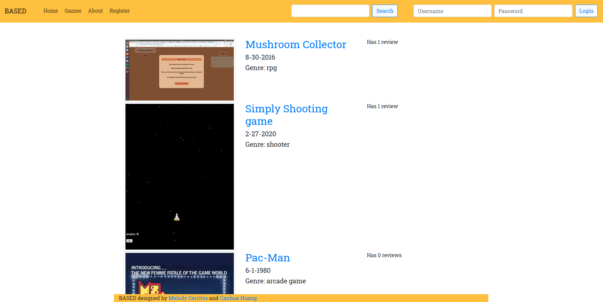
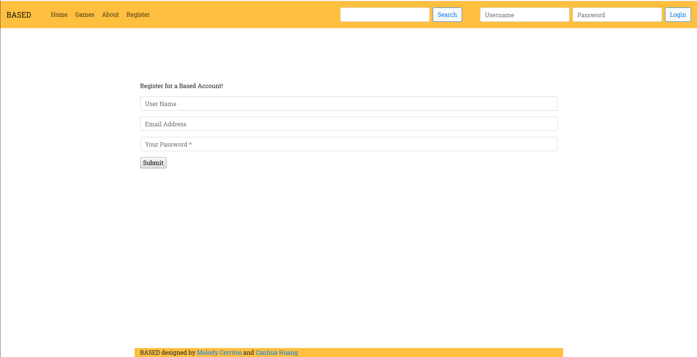

## Based
Based is a collaborative fullstack web application by Canhua Huang and Melody Cerritos, and was built collaboratively using github. It allows users to review their favorite video games and allow people to see the reviews of other games like them. It features session-based authentication and full CRUD functionality on posts and users. 

## Technologies

Frontend - HTMl/ CSS, JavaScript, Bootstrap

Backend - Mongoose, Express, Node

## Milestones

Sprint 1- Creating wireframes, user stories and ERD's necessary to full conceptualize the project before beginning. 

Sprint 2 - Creating the intial Model View Controller setup for the Mongoose Backend, creating intial User, Game and Post models. 

Sprint 3- Establishing full Create, Read, Update and Delete functionality for posts and gamer. Creating seed data for server. 

Sprint 4- Authentication. Creating user models and linking them with posts. Establishing varying levels of permissions for users based on authentication status. 

Sprint 5- Front-End. Creating a unified front-end design using bootstrap for a better GUI experience. 

## Final Product

### Dependencies Installed

bcryptjs
body-parser
connect-mongo
express
express-session
mongodb/mongoose

